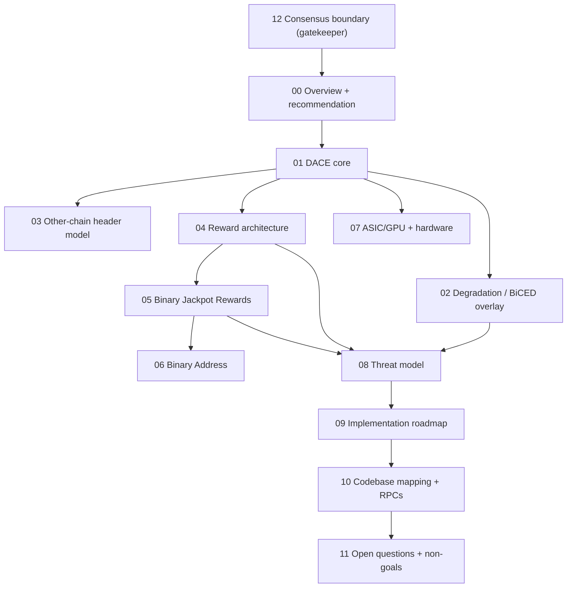

# Binary Chain v2 — Overview and Executive Recommendation

> Read [`12-consensus-boundary.md`](12-consensus-boundary.md) first. It governs
> where every feature in this document is allowed to live.

## 1. Executive recommendation (blunt version)

**Binary Chain v2 should be a DACE-primary hybrid.** DACE is the real engine. BiCED
is a degradation/recovery overlay, not a default per-block mechanism. The jackpot is
an app-layer adoption engine, and the Binary Address is wallet UX. None of the
adoption layers belong in consensus for v2.

This is not a fresh design. DACE is **already specified** (`vericoin/doc/dace/DACE-0..7`
plus phase runbooks) and **already partially implemented** (`vericoin/src/dace/`,
consensus params, RPCs, a binarytest desktop dashboard). The correct framing of
"Binary Chain v2" is **extension + completion + adoption layering**, not reinvention.

### Should v2 be primarily DACE, primarily BiCED, or hybrid?

**Hybrid, DACE-primary.** Concretely:

- **DACE = core.** Every-epoch coupling via deterministic Joint Anchors. It already
  exists and is the right spine.
- **BiCED = degradation/recovery overlay.** BiCED's genuinely good idea is *graceful
  degradation under cross-chain stress*, not constant per-block economic scoring. We
  fold BiCED's best ideas into a deterministic Coupled Degradation Ladder layered on
  DACE's existing stale-coupling mode and recovery anchor.

### Which BiCED components to retain

| BiCED idea | Verdict | How it lands in v2 |
|------------|---------|--------------------|
| Sibling-chain header commitments | Retain (already present) | DACE header `pairedAnchorRef`/`beaconRef`; **no second TLV layer** |
| Other-chain header DB | Retain | Existing `PairedHeaderStore`; add persistence (doc 03) |
| Freshness scoring | Retain as **node metric** | Drives warnings only; never reward roots (doc 02) |
| Stale-but-valid state | Retain | DACE stale-coupling mode already does this |
| Deterministic escrow/reconciliation | Retain | DACE delayed reward accumulators (doc 04) |
| Monitoring and alerting | Retain | `binarychain_metrics`, new `binarychain_degradation` |
| Bounded ahead allowance | Retain | `CoupleLookaheadEpochs = 5` IBD pacing |
| Robust header gossip | Retain | `getxheaders`/`xheaders` (doc 03) |
| Per-block economic degradation | **Reject** | Too aggressive; degrade bonus not base |
| BiCED as default coupling | **Reject** | DACE is the default coupling |

### Which DACE components to retain

Retain essentially all of DACE: extended header, deterministic beacon, bonded ticket
committee, Joint Anchors with delayed activation, delayed reward accumulators with
pull claims, stale-coupling IBD, recovery anchor. These are the foundation of v2.

### Which components to reject or postpone

- **Reject for v2:** any jackpot/exclusion/USD/winner-selection logic in consensus;
  per-block BiCED TLV; new consensus money destinations to fund the jackpot.
- **Postpone to Phase 4:** protocol-native jackpot claims; VRF/VDF beacon hardening;
  private committee self-reveal; wallet-native consensus awareness of Binary Address.

### Simplest safe mainnet path

1. **Finish DACE wiring.** Several pieces are implemented but unwired (beacon selection
   not called, `AnchorLifecycle::Certify` never invoked, claim validation not enforced,
   registry not persisted, Verium side missing). See doc 09 / doc 10.
2. **Build the missing `verium/src/dace/`.** Until Verium produces beacons and includes
   Joint Anchors in coinbase, Binary Chain is not actually binary.
3. **Ship DACE through the existing phased rollout** (Phase 2a shadow → 2b testnet →
   2c audit → 3a soft → 3b hard).
4. **Run Binary Jackpot Rewards as an off-chain foundation promotion** that reads
   on-chain participation proofs. No consensus jackpot.
5. **Ship Binary Address as wallet-only.** A `vbc1` descriptor; consensus untouched.

Prefer secure-and-implementable over impressive. The v2 launch needs **no new
consensus surface beyond DACE itself.**

## 2. Naming hierarchy and framing

### Resolved naming (final)

The existing DACE docs label the system "Binary Chain v3 (DACE)". The requested output
is "Binary Chain v2". These must not coexist casually. Resolution:

| Term | Meaning |
|------|---------|
| **Binary Chain** | Public product / protocol identity (unversioned in marketing) |
| **Binary Chain v2** | Current release / spec package (this document set) |
| **DACE** (Dual-Anchor Coupled Epochs) | The internal epoch-coupling **engine** |
| **BiCED degradation** | The fallback/degraded-mode economics overlay |
| **Binary Jackpot Rewards** | The adoption incentive layer (app-first) |
| **Binary Address** | The unified dual-chain payment descriptor |

> **Action for `doc/dace/`:** the stray "Binary Chain v3" label is pre-release internal
> engine numbering. Footnote or rename it so the public identity stays "Binary Chain"
> and the release is "Binary Chain v2". Do **not** rename the project to DACE or BiCED.

### For blockchain developers

Binary Chain v2 is two sovereign chains — Verium (PoWT, work/reserve) and VeriCoin
(PoST, stake/settlement) — coupled at the epoch level by deterministic **Joint Anchors**.
Each anchor binds a buried Verium PoW beacon to a VeriCoin bonded-committee certificate,
and is activated with a one-epoch delay so foreign-chain data only affects local validity
after finalization. Cross-chain rewards are delayed accumulators with pull-based Merkle
claims, never live foreign payees. When coupling degrades, a deterministic ladder throttles
*bonus* flows while base PoWT/PoST rewards continue untouched. The jackpot and Binary
Address sit strictly outside consensus.

### For investors

Binary Chain v2 makes Verium and VeriCoin mutually reinforce each other's security and
value without merging them or bridging them. Mining Verium and staking VeriCoin both
strengthen the shared "Binary Chain," and participants can earn cross-chain bonus rewards
plus a chance at a large, rare, auditable **Binary Chain Reward Event** every ~90 days.
A single Binary Address lets a user receive both coins. The design deliberately keeps the
prize mechanics off-chain (legally cleaner) and never taxes ordinary miners or stakers.

### For normal users

Download one wallet. Mine Verium, stake VeriCoin, or both. You keep your normal mining
and staking rewards no matter what. On top of that you can earn extra Binary Chain bonus
rewards, and once a quarter there is one big Binary Chain Reward Event for an eligible
individual participant. You get one Binary Address that can receive both coins, so you do
not have to juggle two wallets.

## 3. How the documents fit together

## 4. Design biases (carried through every doc)

- DACE is the core. BiCED is degradation/recovery, not the default every-block dependency.
- Base rewards are sacred. Bonus rewards are programmable.
- Jackpot rewards are app-layer first, protocol-native later (Phase 4 at the earliest).
- No USD oracle in consensus.
- No specialized anchor hardware. Commodity-hardware friendly.
- No live foreign-chain payee requirement.
- No consumer "lottery" language in protocol docs.
- No pool/exchange/custodial address eligibility for the individual major reward.
- Do not overpromise legal safety, ASIC-proofness, or attack impossibility.
