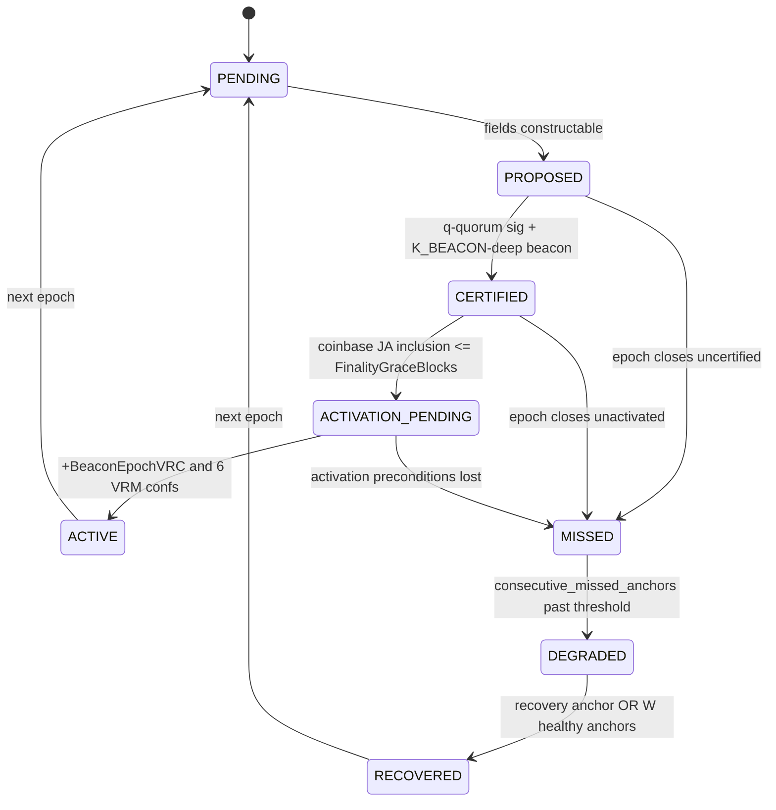

# Binary Chain v2 — DACE Core

> Consensus layer (layer 1). This document consolidates the existing
> `vericoin/doc/dace/DACE-0..7` specs and the `vericoin/src/dace/` implementation
> into the Binary Chain v2 framing, and pins down the **full anchor state machine**.
> Where this doc and `doc/dace/` differ, `doc/dace/` is the lower-level source of
> truth for byte layout; this doc is the source of truth for the public state model.

## 1. One-sentence model

Each chain commits only to the **last activated foreign anchor**, never to live
foreign state, and all paired-chain effects flow through **observe → certify → activate**.

## 2. Roles (sovereign, mutually reinforcing)

| Chain | Ticker | Consensus | Role in Binary Chain |
|-------|--------|-----------|----------------------|
| Verium | VRM | PoWT (scrypt², CPU-oriented) | Contributes a buried PoW **beacon** to each epoch; reserve / commodity / work-security |
| VeriCoin | VRC | PoST (stake-time) | Contributes a bonded-committee **certificate** to each epoch; payment / settlement |

A valid Joint Anchor requires **both halves**: the VRC committee signature *and* the
buried VRM PoW beacon. Neither chain is an oracle, sidecar, bridge, or subordinate.

## 3. Frozen constants (Balanced profile, mainnet default)

From `vericoin/src/consensus/params.h`. Mainnet uses the Balanced column; testnet may
select profiles; binarytest uses an accelerated profile.

| Constant (param name) | Balanced default | Meaning |
|-----------------------|-----------------:|---------|
| `BeaconDelta` (DELTA) | 12 VRM blocks | Beacon stride per epoch |
| `BeaconK` (K_BEACON) | 50 | Confirmations before a candidate becomes the beacon |
| `BeaconFallbackWindow` (W_FALLBACK) | 6 | Bounded fallback ladder window |
| `BeaconEpochVRC` | 60 VRC blocks | Coupling epoch length (~60 min on VRC) |
| `TicketStakeUnit` | 1000 VRC | Fixed bonded ticket size |
| `TicketLockupEpochs` (L) | 6 | Ticket lockup |
| `TicketUnbondDelayEpochs` | 2 | Unbond delay |
| `CommitteeSize` (M) | 128 | Selected committee size per epoch |
| `CommitteeQuorum` (q) | 2/3 | Certification quorum |
| `StaleGraceEpochs` (S_GRACE) | 3 | Grace before liveness warning |
| `StaleMaxEpochs` (S_MAX) | 16 | Max stall before recovery anchor eligible |
| `FinalityWindowSeconds` | 21600 (6h) | Target certification window |
| `RecoveryThreshold` | 4/5 (0.80) | Bonded-weight supermajority for recovery |
| `FinalityGraceBlocks` | 18 | Coinbase JA inclusion deadline |
| `BEACON_EPOCH_VRM_CONF` | 6 | VRM confirmations on coinbase JA inclusion |
| `CoupleLookaheadEpochs` | 5 | IBD pacing lookahead |
| `DivertSigmaBpsVRM` (σ) | 400 (4%) | VRM base subsidy diverted to VRC reward pool |
| `DivertPhiBpsVRC` (φ) | 1000 (10%) | VRC block fees diverted to VRM reward pool |
| `ClaimExpiryEpochs` | 1024 | Unredeemed-claim expiry |
| `BcProtocolVersion` | 90100 | P2P protocol version gate |

Activation/bootstrap (frozen at Phase 0 close, ≥120 days before activation):
`BinaryChainHeightVRC`, `BinaryChainHeightVRM`, `DaceBootstrapHeaderVRC`,
`DaceBootstrapHeaderVRM`, `DaceBootstrapJAGenesis`. Until set, both heights are
`DaceNotScheduled = -1` and DACE is inactive.

## 4. Consensus objects (as implemented)

### 4.1 Extended block header (`primitives/block.h`)

Below activation: legacy 80-byte header. At/above activation: 180-byte extended header
adding `pairedAnchorRef` (uint256), `beaconRef` (uint256), `rewardAccumulatorRoot`
(uint256), `epochIndex` (uint32). The PoS marker moves from legacy `nFlags` to
`nVersion` bit 30. The four new fields are folded into the hashed region via
`daceMerkleRoot = SHA256d(merkleRoot || pairedAnchorRef || beaconRef || rewardAccumulatorRoot || epochIndex)`,
adding ~100 bytes + one SHA256d per hash attempt **outside** the scrypt² memory-hard
inner loop (see doc 07).

### 4.2 Deterministic beacon (`dace/beacon.{h,cpp}`, DACE-2)

```
H_e         = H_0 + e * BeaconDelta            // target VRM height for epoch e
candidate   = first VRM block at height >= H_e
beacon_e    = candidate once (tip.Height - candidate.nHeight) >= BeaconK
```
If a reorg invalidates the candidate before activation, walk a bounded fallback ladder
of up to `BeaconFallbackWindow` next eligible heights. **Timestamps are never inputs.**
Once an anchor activates, its beacon is fixed forever (ratchet).

Struct `Beacon { uint32 epoch_index; uint256 beacon_hash; uint32 beacon_height; uint32 selection_offset; }`
and `BeaconDepthProof { uint256 beacon_hash; uint32 beacon_height; vector<CBlockHeader> succeeding_headers; }`.

### 4.3 Bonded ticket committee (`dace/ticket_registry.*`, `dace/sortition.*`, DACE-3)

```
Ticket { COutPoint stake_outpoint; CPubKey operator_pubkey; uint32 registered_epoch; uint32 unbond_epoch; CAmount stake_amount; }
ticket_id = H(stake_outpoint || operator_pubkey)
```
Registry markers: `TICKET_MARKER_REGISTER = "DCER"`, `TICKET_MARKER_UNBOND = "DCEU"`.
Per-block `ticket_root = MerkleRoot(sorted(ticket_id))` committed in coinbase.

Sortition without replacement:
```
S_e        = H(JA_{e-1}.hash || beacon_e.hash || VRC_checkpoint_{e-1}.hash)
score_i    = H(S_e || ticket_id_i)
committee_e = first M tickets sorted by score   // ties broken by lexicographic ticket_id
```
Slashing offences (evidence = `TicketSlashEvidence`): equivocation (two JAs signed for
same epoch) and conflicting recovery anchor. Slash window = `L + UnbondDelay` epochs;
locked stake burned.

### 4.4 Joint Anchor (`dace/joint_anchor.h`, DACE-4)

```cpp
struct JointAnchor {
    uint32_t  epoch_index;
    uint256   prev_anchor_hash;
    uint256   beacon_ref;
    BeaconDepthProof beacon_proof;
    uint256   vrc_checkpoint_hash;
    uint32_t  vrc_checkpoint_height;
    uint256   reward_root_vrc_prev;
    uint256   reward_root_vrm_prev;
    uint256   committee_root;
    QuorumSignature signature;     // vector<CommitteeSignature{uint16 index; vector<uchar> sig}>
};
// hash = SHA256d(serialize(JA)); certified JA pushed as OP_JA <ja_hash> in coinbase on both chains
```
Phase 1 signature = list of `(committee_index, ECDSA sig)` pairs (~`M*72` bytes).
Phase 4 (future) = Schnorr/musig2 aggregate (~64 bytes).

### 4.5 Reward accumulators + claims (`dace/reward_accumulator.*`, `dace/claim.*`, DACE-5)

Covered in detail in [`04-reward-architecture.md`](04-reward-architecture.md).

## 5. The anchor state machine (public model)

The implementation enum is `AnchorPhase { None, Observed, Certified, Activated }`
(`dace/anchor_lifecycle.h`). Binary Chain v2 exposes a richer **8-state public model**
to users/explorers. The mapping below is authoritative: the 8 public states are a
**presentation + operational** layer derived from the 4 protocol phases plus canonical
counters. Only the protocol phases gate validity.

| Public state | Backed by | Validity effect |
|--------------|-----------|-----------------|
| `PENDING` | epoch open, `AnchorPhase::None`/no candidate yet | none |
| `PROPOSED` | `AnchorPhase::Observed` (all non-signature fields constructable) | none (informational) |
| `CERTIFIED` | `AnchorPhase::Certified` (quorum sig + beacon `K_BEACON`-deep) | cacheable/relayable; not yet a validity dependency |
| `ACTIVATION_PENDING` | Certified, awaiting epoch delay + VRM coinbase inclusion | none yet |
| `ACTIVE` | `AnchorPhase::Activated` (= `JA_active`) | blocks must reference `JA_e.hash()` as `pairedAnchorRef` |
| `MISSED` | epoch closed without certification | none directly; increments `consecutive_missed_anchors` |
| `DEGRADED` | `consecutive_missed_anchors` past ladder thresholds | modulates *bonus* roots only (doc 02) |
| `RECOVERED` | recovery anchor activated, or `W` healthy anchors after degradation | resumes normal accrual |

### 5.1 Deterministic transitions

Every transition below is computable from canonical accepted-chain data alone, so all
honest nodes agree.

```text
PENDING -> PROPOSED
  when: all JA_e non-signature fields are constructable from accepted chain state
        (beacon candidate chosen for epoch e; VRC checkpoint known).

PROPOSED -> CERTIFIED
  when: QuorumSignature verifies against committee_root with >= q (2/3) weight
        AND beacon_e is K_BEACON-deep on accepted VRM chain.
  impl: AnchorLifecycle::Certify(partial_hash, sig, committee, params).

CERTIFIED -> ACTIVATION_PENDING
  when: JA_e.hash pushed into a VRM coinbase (OP_JA) within FinalityGraceBlocks (18);
        otherwise further blocks invalid until inclusion (liveness pressure).

ACTIVATION_PENDING -> ACTIVE
  when: certified_at_vrc_height + BeaconEpochVRC <= current_vrc_height
        AND JA_e.hash included in VRM coinbase with >= BEACON_EPOCH_VRM_CONF (6) confs.
  impl: AnchorLifecycle::PromoteIfActivated(vrc_height, vrm_inclusions, params).
  effect: JA_e becomes JA_active; beacon ratchets (immutable thereafter).

CERTIFIED/ACTIVATION_PENDING -> MISSED
  when: epoch e ends (epoch e+? boundary reached) without reaching ACTIVE,
        i.e. no activated anchor exists for epoch e.
  effect: consecutive_missed_anchors += 1 (canonical, from accepted chain).

MISSED -> DEGRADED
  when: consecutive_missed_anchors crosses a ladder threshold (doc 02).
        Derived strictly from accepted-chain anchor state (footgun guard, doc 12).

DEGRADED -> RECOVERED
  when: a recovery anchor activates (after StaleMaxEpochs with RecoveryThreshold weight)
        OR W consecutive healthy activated anchors observed after degradation.

any -> (rewind)
  on reorg: AnchorLifecycle::Rewind(target_vrc_height, params) demotes anchors whose
            activation preconditions no longer hold and recomputes JA_active.
            Already-ACTIVE anchors with ratcheted beacons are not un-ratcheted unless
            the activating chain segment itself is reorged out.
```

### 5.2 State diagram



### 5.3 The one hard requirement

**Every honest node must compute the same anchor state from chain data alone.** This is
why beacon selection is height/depth-based (not timestamp), why foreign data only affects
validity after activation, and why the degradation state is derived only from canonical
`consecutive_missed_anchors` (doc 12 footgun guard).

## 6. Local block validity invariants (DACE-1/DACE-4)

For a block at height `h >= BinaryChainHeight`:

1. 180-byte extended header round-trips exactly.
2. `pairedAnchorRef == hash(JA_active)` (latest **activated** anchor). A block may carry
   newer observed/certified anchor objects, but those are **not** current validity deps.
3. `beaconRef ==` deterministic beacon for `epochIndex` (DACE-2).
4. `rewardAccumulatorRoot ==` locally computed prior-epoch escrow root (DACE-5).
5. `epochIndex == floor((h - BinaryChainHeight) / BeaconEpochVRC)` (VRC side).

Reward redemption is **pull-based** (Merkle proof against an activated JA); no block
needs live foreign payee data. Finality is **bounded, not absolute**: stalls enter
stale-coupling, and prolonged stalls use the recovery anchor — never an irreversible
kill switch.

## 7. What is implemented vs unwired (as of this writing)

Implemented: structs + serialization, extended header hashing, `CheckExtendedHeader`/
`OnConnectBlock` wiring, in-memory ticket registry logic, claim validation helpers,
beacon selection + depth proof, sortition, `Certify`/`PromoteIfActivated`, stale-coupling
class, recovery validation, `xheaders` ingestion, 7 `binarychain_*` RPCs.

Unwired / Phase-1 stubs (prerequisites, see doc 09/10): `SetSelectedBeacon` not called in
normal flow; `SampleCommittee` not called from connect; `AnchorLifecycle::Certify` never
invoked; claim validation not enforced in validation/mempool; registry not persisted
(`LoadFromDisk` not called); `getxheaders`/`getja`/`jasig` are no-ops; binarytest JA uses
a stub signature `{0xDA,0xCE}`; **`verium/src/dace/` does not exist at all.**
