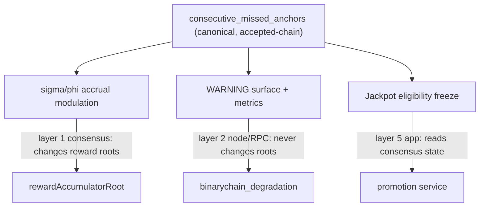

# Binary Chain v2 — Coupled Degradation Ladder (BiCED Integration)

> Mixed layer. The σ/φ-modulating rung is **consensus** (layer 1). Warnings and
> freshness scoring are **node policy / RPC** (layer 2). Jackpot-eligibility freezing
> is an **app-layer** reaction (layer 5). See [`12-consensus-boundary.md`](12-consensus-boundary.md).

## 1. Thesis

BiCED's genuinely valuable contribution is **graceful degradation under cross-chain
stress**, not constant per-block economic scoring. Binary Chain v2 therefore does **not**
adopt BiCED as a default coupling mechanism. Instead it folds BiCED's best ideas into a
deterministic **Coupled Degradation Ladder** that rides on top of DACE's existing
stale-coupling mode and recovery anchor.

The non-negotiable principle: **base rewards are sacred; only bonus flows degrade.**

## 2. What "missed anchor" means (canonical, replayable)

The ladder is keyed off `consecutive_missed_anchors`, which **must be derived strictly
from canonical accepted-chain anchor/epoch state** (doc 12 footgun guard):

> `consecutive_missed_anchors` = the number of consecutive most-recent coupling epochs
> for which **no activated Joint Anchor exists** in the accepted chain.

This is a fact about the accepted chain, identical for all honest nodes. It is **not**
derived from local peer lag, local header availability, gossip timing, or dashboard
health. Those local freshness signals exist (see §6) but only drive **warnings**, never
reward roots.

## 3. The ladder

| `consecutive_missed_anchors` | Public state | Economic effect | Layer |
|---:|---|---|---|
| 0 | NORMAL | Full σ/φ accrual; jackpot eligibility live | 1 (accrual) |
| 1 | WARNING | None (informational only) | 2 |
| 2 | BONUS_ACCRUAL_REDUCED | σ/φ accrual rate reduced (e.g. ×0.5); **base untouched** | 1 |
| 3 (= `StaleGraceEpochs`) | BONUS_ESCROWED | σ/φ still computed but **not activatable**; jackpot eligibility frozen | 1 (escrow) + 5 (eligibility) |
| 4 .. `StaleMaxEpochs-1` | BINARY_MODE_DEGRADED | Cross-chain bonus accrual **paused**; both chains keep producing base blocks; stale-coupling continues | 1 |
| `StaleMaxEpochs` (16) | (recovery eligible) | Recovery anchor path opens (`RecoveryThreshold = 4/5`) | 1 |
| — | RECOVERED | After recovery anchor activates **or** `W` consecutive healthy activated anchors; accrual resumes ramped | 1 |

Notes:

- **Base subsidy (VRM) and base staking rewards (VRC) are never reduced by the ladder.**
  Reducing the σ/φ *diversion* simply means a larger share stays with base miners/stakers
  during stress — base is strictly protected.
- "Reduced (×0.5)" and the recovery window `W` are parameters to fix at Phase 0 (see
  open questions, doc 11). Recommended starting point: reduction factor `0.5`,
  `W = 3` healthy anchors.
- The escrowed-but-not-activatable rung uses DACE's existing delayed-activation machinery:
  accruals are recorded in `rewardAccumulatorRoot` but the claims cannot be redeemed until
  a fresh activated anchor carries the root forward.

### 3.1 Consensus vs non-consensus split inside the ladder



- **Consensus (layer 1):** the mapping from `consecutive_missed_anchors` to the σ/φ accrual
  multiplier, because it changes `rewardAccumulatorRoot` and thus block validity. It must
  be a pure function of canonical state.
- **Node/RPC (layer 2):** WARNING, freshness scores, lag percentiles, dashboard color.
- **App (layer 5):** freezing jackpot eligibility is a promotion-service reaction to the
  consensus-visible degradation state; it is not itself a consensus rule.

## 4. Recovery

Recovery is DACE's existing mechanism, surfaced as the `RECOVERED` public state:

- After `StaleMaxEpochs` (16) consecutive epochs without an activated anchor, a
  **recovery anchor** may be built and certified by `RecoveryThreshold` (4/5) of bonded
  ticket weight. It still requires a `K_BEACON`-deep VRM beacon and follows the
  activated-only validity rule. `RecoveryAnchor` reuses `JointAnchor` with
  `RECOVERY_FLAG_BIT = 0x80000000` set in the high byte of `epoch_index`.
- Conflicting recovery anchors are a slashable offence (DACE-3).
- On activation of a recovery anchor (or after `W` healthy normal anchors), accrual resumes
  on a ramp to avoid a sudden bonus spike.

**There is no irreversible kill switch.** Prolonged failure pauses *bonus* coupling and
leans on the recovery anchor; both chains keep producing base blocks throughout.

## 5. TLV cadence — explicitly no second commitment layer

DACE already commits the coupling surface in **every** extended header
(`pairedAnchorRef`, `beaconRef`, `rewardAccumulatorRoot`, `epochIndex`). Therefore:

> Where implemented, DACE header commitments already provide the canonical coupling
> surface. BiCED-style TLV must **not** add a second competing commitment layer.

- No per-block BiCED TLV blob.
- Degradation is evaluated **per epoch at anchor windows**, not per block.
- The only per-block consensus quantity the ladder touches is the σ/φ accrual multiplier,
  which is already folded into the existing `rewardAccumulatorRoot` computation.

This keeps the PoWT hot path untouched (doc 07) and avoids divergent commitment layers.

## 6. BiCED freshness scoring as a node-local health metric

BiCED's freshness/scoring idea is retained, but **demoted to layer 2**. The node computes
local health signals and exposes them via RPC; none of them feed reward roots:

| Signal | Source | Use |
|--------|--------|-----|
| paired-header lag p50/p95/p99 | `PairedHeaderStore` vs local clock | `binarychain_status` hint |
| stale-coupling entries | `StaleCouplingTracker` | metric |
| bounded-ahead allowance | `CoupleLookaheadEpochs = 5` | IBD pacing |
| committee missed votes | observed gossip | metric / monitoring |

Operators alert on these; consensus ignores them.

## 7. Bounded-ahead allowance

A node will process local blocks only while it holds paired headers covering up to
`tipHeight + CoupleLookaheadEpochs (5)` epochs. Beyond that it **pauses** (does not halt)
local processing until paired headers catch up. This is BiCED's "bounded ahead" idea,
already present as `CoupleLookaheadEpochs`.

## 8. RPC surface (layer 2)

`binarychain_degradation` (new) returns, all derived from canonical chain state:

```json
{
  "consecutive_missed_anchors": 0,
  "ladder_state": "NORMAL",
  "sigma_accrual_multiplier_bps": 10000,
  "phi_accrual_multiplier_bps": 10000,
  "bonus_escrowed": false,
  "recovery_eligible": false,
  "healthy_anchors_since_degraded": 0,
  "local_freshness": {
    "paired_header_lag_p95_sec": 0,
    "stale_coupled": false,
    "stale_reason": ""
  }
}
```

The `local_freshness` block is explicitly **node-local** and labeled as such, so no
consumer mistakes it for a consensus input.

## 9. Test cases required (see doc 08/09)

- Ladder transitions at exactly thresholds 1/2/3/4 and at `StaleMaxEpochs`.
- Two nodes with different peer connectivity compute **identical** σ/φ multipliers
  (footgun regression test).
- Base subsidy/stake unchanged across all ladder states.
- Recovery anchor activation returns ladder to `RECOVERED` then `NORMAL` after `W`.
- Escrowed bonus becomes claimable only after a fresh activated anchor carries the root.
