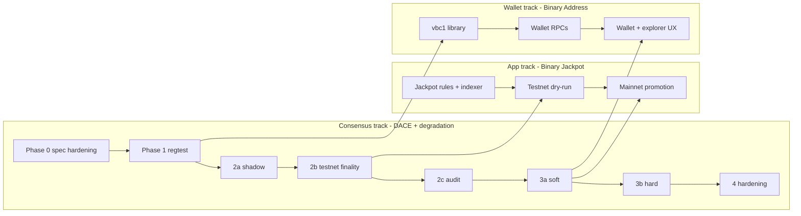

# Binary Chain v2 — Implementation Roadmap

> Aligns with the existing phase runbooks in `vericoin/doc/dace/` (phase-2a/2b/2c,
> phase-3a/3b, phase-4-*). Adds the jackpot and Binary Address as app/wallet tracks.

## Track overview

Three parallel tracks, gated so the riskiest (consensus) leads and the adoption layers ride
on top:

## Phase 0 — Spec hardening (this document set)

- Finalize the DACE/BiCED hybrid rules (these docs).
- Pin the anchor state machine (doc 01) and degradation ladder parameters (doc 02): set the
  σ/φ reduction factor and recovery `W`.
- Confirm the reward accumulator model and the expired-claim destination (doc 04).
- Define Binary Jackpot **app-layer** rules and config (doc 05).
- Define Binary Address v1 (doc 06).
- **Decide consensus vs wallet/app for every item** — done in doc 12.
- Freeze activation/bootstrap constants (`BinaryChainHeightVRC/VRM`, `DaceBootstrap*`) ≥120
  days before activation.
- Resolve the v2/v3 naming (doc 00).

**Prerequisite cleanup (unwired DACE pieces, from code review):**

- Wire beacon selection (`SetSelectedBeacon`/`SelectBeacon`) into the connect/validation flow.
- Wire `SampleCommittee`/`ComputeSortitionSeed` into anchor construction.
- Invoke `AnchorLifecycle::Certify` (currently never called) via the `jasig` assembly window.
- Enforce `ValidateClaim` in validation + mempool; fill `recipient_pkh` by wallet policy.
- Persist the ticket registry (`LoadFromDisk`/`Flush`) and the VRM-inclusions map.
- Implement `getxheaders` serving, `getja`, and `jasig` (currently no-ops).
- **Build `verium/src/dace/`** — the largest gap; without it Binary Chain is not binary.
- Apply the degradation σ/φ multiplier in accrual.

## Phase 1 — Regtest simulation (two-daemon harness)

Extend `vericoin/test/binarychain/` + functional tests. Must test:

- normal anchors; missed anchors; degraded mode; recovery;
- VRM reorgs; VRC reorgs; both-chain reorgs;
- stale headers; invalid headers; parked blocks;
- reward claims (redeem, double-claim rejection, expiry);
- jackpot eligibility roots; deterministic winner selection; pool rollover;
- Binary Address payout decoding (two-daemon native payout);
- CPU-fairness check (`cpu-fairness-check.md`, ≤1.05×) — gate to Phase 2.

## Phase 2a — Shadow mode (~45 days, testnet)

Per `phase-2a-shadow-mode-runbook.md`. Activate beacon selection, accumulator computation,
and JA construction/gossip as **observational only** (`-dace-shadow-mode=1`); no consensus
effect. Gate: 30 consecutive days zero divergent beacons, zero IBD replay diffs,
stale-coupling <1% epochs, no Critical/High bugs.

## Phase 2b — Testnet finality (≥90 days)

Per `phase-2b-testnet-finality-runbook.md`. Full DACE enforcement: ticket registry,
committee sortition, JA certification + slashing, claims enabled, header commitments enforced
(`-dace-shadow-mode=0`). Run adversarial drills (partition, 33% offline, stale-coupling,
recovery, equivocation, replay). **Jackpot dry-run with test coins only** begins here.
Gate: all drills pass, ≥90% epochs certified in window, ≥99% claim success, clean replay.

## Phase 2c — Audit + bug bounty (6–8 weeks)

Per `phase-2c-audit-charter.md`. External audit of DACE-0..7 + binary-chain-v2 docs +
`vericoin/src/dace/` + new degradation/claim wiring + Binary Address library. 4-week bug
bounty. Gate: clean-pass attestation or all Critical/High fixed and re-reviewed.

## Phase 3 — Mainnet soft rollout

Per `phase-3a-soft-activation-runbook.md`:

- App-layer Binary Jackpot using on-chain participation proofs goes **live on mainnet** as a
  foundation promotion (no consensus jackpot).
- DACE anchors activate with conservative parameters; `pairedAnchorRef` **advisory only**
  (`DaceSoftActivationOnly = true`) — mismatches log, don't reject.
- BiCED degradation runs in the **warning/bonus layer first**.
- Binary Address wallet support + explorer surfaces ship.
- Monitor 30 days. Gate: zero IBD diffs, soft-warning <0.1% blocks, stale-coupling <5%
  epochs, ≥80% epochs certified in window.

## Phase 3b — Mainnet hard activation

Per `phase-3b-hard-activation-runbook.md`: `pairedAnchorRef` mismatches reject blocks
(`DaceSoftActivationOnly = false`); `BcProtocolVersion` enforcement at T+7; degradation σ/φ
modulation becomes mandatory consensus. **Rollback caveat:** emergency consensus rollback is
not available by design; mitigations are extend `S_MAX`, tighten `K_BEACON`, disable claim
redemption, and the recovery anchor.

## Phase 4 — Protocol-native hardening (optional, ≥12 months mainnet)

Per `phase-4-*` runbooks, **evaluation-only, full BIP cycle required**:

- Optional protocol-native reward accumulators refinements.
- Optional protocol-native jackpot claims — **only** if made fully deterministic with no
  subjective input (no address classification, no USD); otherwise stays app-layer forever.
- Compact committee/stake proofs (doc 03 §6) so either side can verify certificates succinctly.
- Refined eligibility registries.
- Wallet-native / possibly consensus-aware Binary Address (own BIP).
- VRF/VDF beacon hardening, private committee self-reveal — evaluation only.
- Repo unification (`phase-4-repo-unification.md`): fold standalone `verium/` into the unified
  tree once Verium-side DACE is mainnet-stable.

## Sequencing rule

The consensus track gates the others: the jackpot dry-run waits for Phase 2b, mainnet jackpot
promotion waits for Phase 3a, and any *promotion-to-consensus* of an app-layer feature waits
for Phase 4 and must satisfy the doc 12 promotion criteria.
